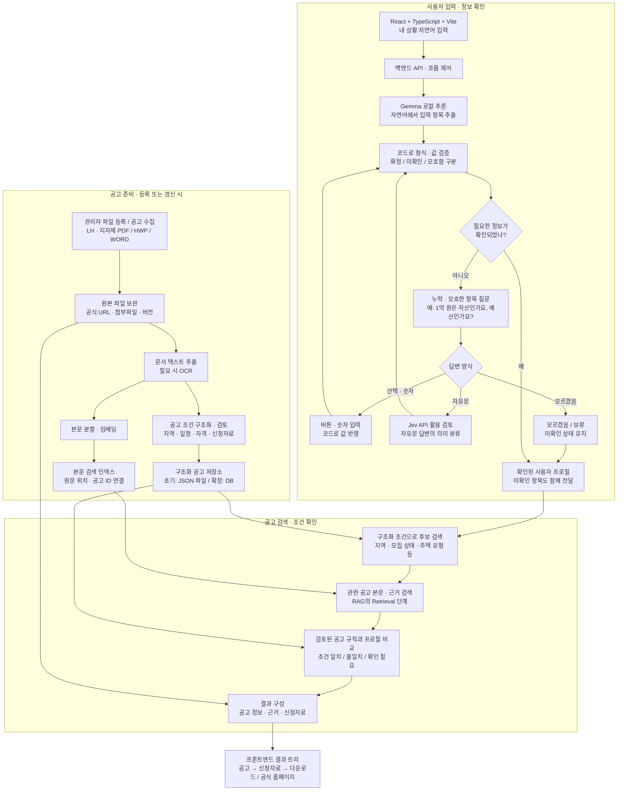
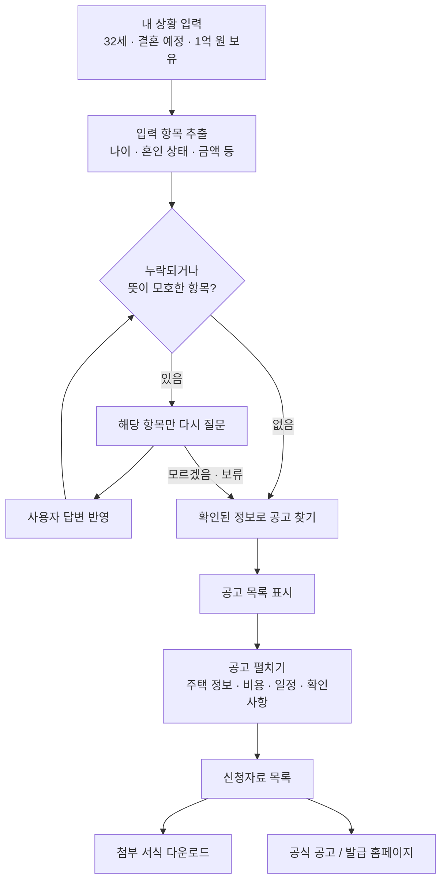

# 누보 시스템 아키텍처와 화면 흐름

이 문서는 대화에서 정리한 **목표 아키텍처**입니다. 현재 저장소에는 React + TypeScript + Vite로 만든 하드코딩 화면만 구현되어 있습니다. 아래의 Gemma, Jev, 공고 전처리, 검색, 조건 판정, 저장소 연결은 향후 구현 대상입니다.

## 1. 전체 아키텍처

공고를 미리 처리해 보관하는 흐름과 사용자가 집을 찾는 흐름을 분리합니다. 사용자 요청마다 인터넷 전체를 검색하지 않고, 준비된 공고 데이터에서 후보와 근거를 찾는 구조입니다.



### 구성요소의 역할

| 구성요소 | 맡는 일 |
| --- | --- |
| React + TypeScript + Vite | 자연어 입력, 추가 질문, 공고 목록, 신청자료 트리를 표시합니다. |
| 백엔드 | 입력 검증, 질문 순서, 모델 호출, 공고 검색, 결과 조합을 관리합니다. |
| Gemma | 처음 입력한 자연어를 정해진 항목으로 추출하는 역할을 계획합니다. 로컬 실행 방식과 모델 크기는 별도 검증합니다. |
| Jev | 추가 질문에 대한 자유문 답변을 정해진 의미로 분류하는 용도로 검토합니다. 실제 API 사양·정확도·비용 확인 후 연결합니다. |
| 검증·규칙 코드 | 선택값 처리, 누락 탐지, 다음 질문 선택, 공고별 조건 비교를 담당합니다. |
| 공고 저장소 | 원본, 구조화 조건, 신청자료, 출처와 버전을 재사용할 수 있게 보관합니다. |
| 검색 인덱스 | 미리 처리한 공고 본문에서 관련 부분과 근거를 찾습니다. |

Jev가 자격을 자동으로 확정하거나 질문 전체를 스스로 관리하는 구조는 아닙니다. 다음 질문은 백엔드가 필요한 항목과 확인 상태를 보고 선택하고, 버튼으로 받은 값은 모델 호출 없이 처리합니다. 모델이 추측한 값을 곧바로 확정값으로 사용하지 않습니다.

## 2. 사용자가 경험하는 흐름



모르겠다는 답변을 받으면 같은 질문을 무한 반복하지 않습니다. 확인 가능한 범위의 공고를 보여주고, 판단에 필요한 정보가 빠진 항목은 **확인 필요**로 남깁니다.

최종 결과의 표현 예시는 다음과 같습니다.

```text
공고 목록
├─ 공고 A
│  ├─ 주택 정보 · 비용 · 모집 일정
│  ├─ 조건 확인 결과 · 근거 · 미확인 항목
│  └─ 신청자료
│     ├─ 입주 신청서 → 첨부파일 다운로드
│     ├─ 동의서 → 첨부파일 다운로드
│     └─ 증명서 → 공식 발급 홈페이지
└─ 공고 B
   └─ 공고 정보 및 공고별 신청자료
```

## 3. RAG와 저장소의 범위

- **공고 수집**은 외부 사이트·API 또는 관리자 업로드를 통해 자료를 가져오는 일입니다.
- **전처리·인덱싱**은 파일에서 텍스트와 조건을 추출하고 검색 가능한 형태로 저장하는 일입니다.
- **검색(Retrieval)**은 저장된 공고에서 후보와 관련 근거를 가져오는 일입니다.
- **RAG**는 검색한 근거를 생성 모델에 전달해 답변을 생성하는 방식입니다. 이 기본 설계에서는 공고·신청자료를 정해진 화면으로 조합하므로, 검색 후 생성 모델을 반드시 다시 호출할 필요는 없습니다. 근거 기반 설명 생성은 향후 선택 기능입니다.

파일만 보관해도 재사용할 수 있습니다. 다만 검색할 때마다 전체 PDF/HWP/WORD를 다시 읽지 않도록 추출 결과와 인덱스를 함께 저장합니다. 초기에는 **원본 파일 + 구조화 JSON + 로컬 검색 인덱스**로 시작할 수 있고, 데이터 규모와 동시 접근 요구가 늘면 DB를 도입할 수 있습니다.

공고 ID와 버전을 기준으로 원본·JSON·검색 인덱스를 연결하고, 공고가 수정되거나 종료되면 관련 데이터를 함께 갱신하는 설계를 전제로 합니다. 모집 상태처럼 정확한 값이 필요한 필터와 자격 조건 확인은 의미 검색 결과만으로 처리하지 않습니다.

## 4. 입력 항목과 판단 범위

기존 공고 분석에서 **16개 파라미터를 받는 방향**이 논의되었지만, 정확한 목록과 정의는 이 저장소에 아직 확정되어 있지 않습니다. 현재 화면에는 나이·혼인 상태의 예시 프로필과 금액 의미·희망 지역·주택 보유·소득의 추가 질문만 있습니다.

실제 구현 전에는 16개 항목의 이름, 타입, 단위, 미확인 값, 적용 기준을 정해야 합니다. 공고마다 본인과 가구원 범위, 소득·자산 기준, 기준일이 다를 수 있으므로 공고별 추가 정보가 필요한지 확인해야 합니다. 이 문서는 모든 공고를 16개 항목만으로 판정할 수 있다고 확정하지 않습니다.

## 5. 현재 구현과 향후 연결

| 항목 | 현재 화면 프로토타입 | 목표 구현 |
| --- | --- | --- |
| 초기 입력 | 어떤 문장을 넣어도 고정 예시 프로필 사용 | Gemma로 항목 추출 후 검증 |
| 추가 질문 | 고정된 4개 선택형 질문 | 필요한 항목만 질문, 자유문 분류에 Jev 활용 검토 |
| 프로필 | React 메모리 상태 | 백엔드에서 검증된 구조화 프로필 관리 |
| 공고 | 가상 공고 3개 | 사전 등록·갱신한 실제 공고 |
| 검색 | 지역·유형 필터 | 구조화 검색 + 관련 본문 검색 |
| 조건 판단 | 실제 자격 판단 없음 | 검토된 공고 규칙과 확인된 정보 비교 |
| 결과 화면 | 공고·신청자료 트리, 관심 공고, 준비 상태 체크 | 실제 공고·자료·출처 연결 |
| 다운로드 | 시연용 TXT | 공고 첨부파일 또는 공식 발급 페이지 |
| AI·저장소 | 연결 없음 | 백엔드에서 모델·저장소 연결 |

현재 구현의 실행 방법은 [README](../README.md)를 참고하세요.
